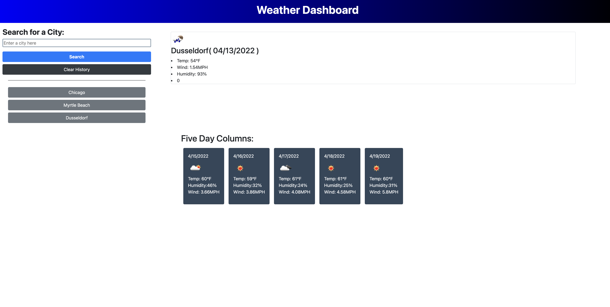

# Weather-Dashboard

## Description
Collects current weather reports for any city including a 5 day weather forecast.

### Programming Languages

* HTML 
* CSS 
* Bootstrap
* Javascript

## Usage
Enter a city name into the input field.  You may also find a button with a city you have previously entered listed below.

### Screenshot

### URL of the deployed application (GitHub Pages):
<https://ashoknayakii.github.io/weather-dashboard>

### URL of the GitHub repository:
<https://github.com/ashoknayakii/weather-dashboard>
    